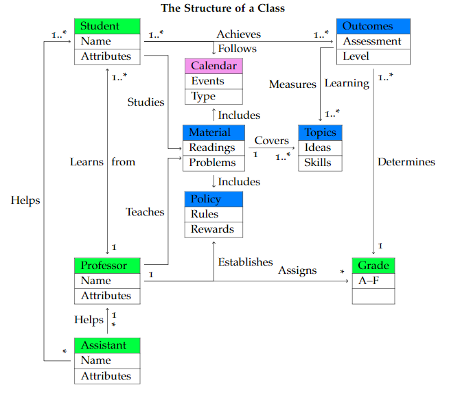

### CSE3100: Junior Project
Class Syllabus
William Shoaff
Computer Engineering & Sciences
College of Engineering & Science Florida Tech
Spring 2022 (compiled: November 19 , 2021 )
<div class="center">


</div>

## Course Schedule

CRN Course Number Title Days Times Place

26936 CSE 3100 Junior Projects M 3 : 00 Olin Life Science 129

## Course Description

**Introduces the concepts and methodology of software project de-
velopment. Forms teams and develops team proposals for capstone
design projects that will be implemented during the senior year.
Allows juniors to interact with seniors completing capstone design
projects. Prerequisite: CSE 2010 (Credit Hours: 1 )**

Majors in Computer Science ( 7071 ) or Software Engineering ( 7075 ).
Minimum student level – Junior

## Students, Professor & Assistants

### Students

This is a team-based course. Get to know your fellow classmates.
Help each other.

### The Professor

```
William David Shoaff
Room 209 , L3Harris Center for Science and Engineering
wds@cs.fit.edu
(Please don’t use Canvas to send me an email, it creates an indirection making communication difficult)

Office: (321)674-8066 ; Home: (321)474-7823


Office Hours: WDS Personal Meeting Room Zoom ID –569 113 5725
MWF 10 : 00 – 11 : 30 , or by appointment, walk-ins welcome


Teaching Hours:
CSE 4083 / 5210 MWF 10 : 00 A.M. Evans Library 133 ;
CSE 4101 / 4201 MWF 11 : 00 A.M. Crawford 404 ;
CSE 4081 / 5211 MWF 1 : 00 P.M. Crawford 220 ;
CSE 3100 M 3 : 00 P.M. Olin Life Sciences 129 ;


Office 32 16 74-80 66; Home 321474-7823
Personal Zoom Meeting ID:941 0467 7146
```

### Assistants

TBA: None expected; Your faculty advisor.

## Calendar

Topics: Due Dates are subject to change based on the flow of the
course.

- Milestone 1 – Exploring the Senior Projects of those ahead of
    you Due: Monday, February 7 ) Description posted on the Canvas
    Learning management system
- Milestone 2 – Working as a team Due: Monday, February 28.
    Description posted on the Canvas Learning management system
- Milestone 3 – Tasks for successful completion of a senior project
    Due: Monday, March 14. Description posted on the Canvas Learn-
    ing management system
- Milestone 4 – Presenting your project to others Start on Monday,
    April 4. Description posted on the Canvas Learning management
    system

## Student Outcomes

1. Understand how others analyze complex problems and apply
principles of computing and software engineering to identify
solutions.

2. Communicate effectively in writing and presentations.

3. Function effectively as a member of a team engaged in activities
appropriate to computer science and software engineering.

## Topics

- Current senior projects
- Identifying opportunities
- Generating ideas
- Developing proposals


## Material

See Dr. Chan’s senior projects web site for Senior Projects informa-
tion.
In particular, look at:

- Current senior projects
- Identifying Opportunities and Generating Ideas
- Resources
    **-** Imagine Cup
    **-** Design Thinking (Stanford)
    **-** Video on design thinking

## Policies

### Courses Recording

#### NOTICE TO COURSE PARTICIPANTS:

This course may be recorded for use by students or faculty. En-
rolled students are subject to having their images and voices recorded
during the classroom presentations, remote access learning, and
online course discussions. Course participants should have no expec-
tation of privacy regarding their participation in the class. Record-
ings may not be reproduced, shared with those not registered in the
course, or uploaded to other online environments. All recordings will
be deleted at the conclusion of the academic term.

### Mandatory Face Covering

In accordance with “Florida Tech Safe: Return to Learn” procedures,
instructors will enforce Florida Tech’s mandatory face covering pol-
icy in all classrooms and teaching labs. All students must wear ap-
propriate face coverings that cover their mouth and nose during all
face-to-face course meetings. Students who fail to comply with this
policy will be required to leave the classroom immediately. Students
unable to comply may contact the Dean of Students Rodney Bowers
for further options.


### Title IX

The Patsy Mink Equal Opportunity in Education Act, AKA Title IX:

```
Suggested	Syllabus	Language
J.	Oglesby: 02/06/


What	is	Title	IX?
Title	IX	of	the	Educational	Amendments	Act	of	1972	is	the	federal	law
prohibiting	 discrimination	based	on	sex	under	any	education	program
and/or	activity	operated	by	an	institution	receiving	and/or	benefiting
from	federal	financial	assistance.


Behaviors	that	can	be considered	“sexual	discrimination”	include	sexual
assault,	sexual	harassment,	stalking,	relationship	abuse	(dating	violence
and	domestic	violence),	sexual	misconduct,	and	gender	discrimination.
You	are	encouraged	to	report	these	behaviors.
Reporting
Florida	Tech	can	better	support	students	in	trouble	if	we	know	about
what	is	happening.		Reporting	also	helps	us	to	identify	patterns	that
might	arise	– for	example,	if	more	than	one	complainant	reports	having
been	assaulted	or	harassed	by	the	same	individual.
Florida	Tech	is	committed	to	providing	a	safe	and	positive	learning
experience.		To	report	a	violation	of	sexual	misconduct	or	gender
discrimination,	please	contact	Security	at	321- 674 - 8111.	 *	Please	note
that	as	your	professor,	I	am	required	to	report	any	incidences	to
Security or	to	the	Title	IX	Coordinator	(321- 674 - 8700). For	confidential
reporting,	please	contact	CAPS	at	321- 674 - 8050.

Fanak Baarmand has the position of Title IX Coordinator for the
university. All incidents or complaints concerning Title IX policy
violations should be referred to her.
Office: Room 135 , Quad 401 , Miller Building Extension: 8885
Email: fbaarman@fit.edu
```

### Plagiarism

```
Students are encouraged to help each other on assignments, but
plagiarism and use of external Question & Answer sites are pro-
hibited.
```
- First violation: zero on assignment/test


- Second violation: ’F’ for the course


## Grades

```
http://upload.wikimedia.org/wikipedia/commons/5/5c/Ambox_s...
1 of 1 8/15/11 2:04 PM
```
- 25 %: Homework 1
- 25 %: Homework 2
- 25 %: Homework 3
- 25 %: Homework 4
- A: 90 %, B: 80 %, C: 70 %, D: 60 %, F: 0 – 59 %

## References

Bloom, B. S. ( 1956 ). TaxonomyofEducationalObjectives:The
ClassificationofEducationalGoals. D. McKay Co., New York.

Lipson, C. ( 2004 ).DoingHonestWorkinCollege:HowtoPrepare
Citations,AvoidPlagiarism,andAchieveRealAcademicSuccess.
University of Chicago Press, Chicago.

Paul, R. and Elder, L. ( 2001 ).AMinatureGuidetoCriticalThinking:
Concepts&Tools. The Foundation for Critical Thinking.
[http://www.criticalthinking.org.](http://www.criticalthinking.org.)
